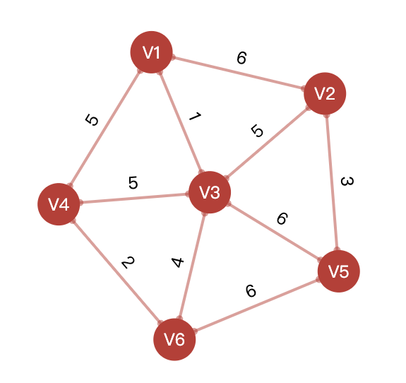
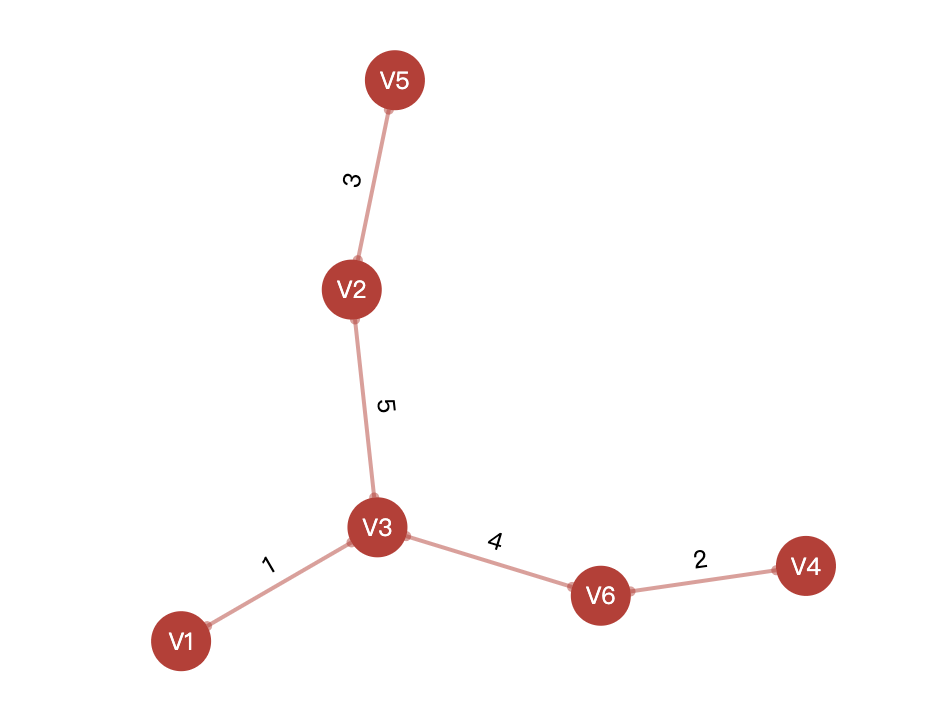
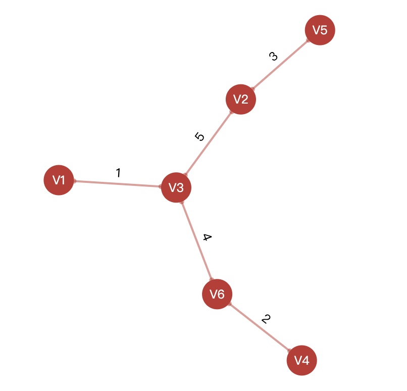

## CSE 5311 DSGN & ANLY ALGORITHMS

### Project Report

**Name: Hao Chen**

**Student ID: 1001889073**

-------------------

### Project 4: Minimum Spanning Tree

Implement and compare the following Minimum Spanning Trees algorithms:   
● Kruskal algorithm    
● Prim algorithm   

-----------------------

### Main Data Structures

- Array
- Heap
- Hash Table
- Graph

--------------

### Main Components of The Algorithm

**mst.py**

```python
class MST(object):
		"""Initialize MST class"""
    def __init__(self, opt, edgelist, nodelist):
    
    """Generate original graph"""
    def originGraph(self):
    
    """Prim tree algorithm"""
    def primTree(self):
    
    """Prim tree algorithm optimized by using heap"""
    def primTreeWithHeap(self):
    
    """Kruskal tree algorithm"""
    def kruskalTree(self):
```

-----------------

### User-Interface

We build a web interface for MST through flask framework.

```python
"""Visualize original graph"""
@app.route('/graph', methods=['POST', 'GET'])
def get_graph():

"""Visualize prim tree"""
@app.route('/prim', methods=['POST', 'GET'])
def get_prim_tree():

"""Visualize optimized prim tree"""
@app.route('/prim_with_heap', methods=['POST', 'GET'])
def get_prim_tree_with_heap():

"""Visualize Kruskal tree"""
@app.route('/kruskal', methods=['POST', 'GET'])
def get_kruskal_tree():
```

For example, we input a graph:

```
V1-V2-6
V1-V3-1
V1-V4-5
V2-V3-5
V2-V5-3
V3-V4-5
V3-V5-6
V3-V6-4
V4-V6-2
V5-V6-6
```

**Original graph:**



**Prim tree:**




**Kruskal tree:**



----------------

### Run Time Analysis

| Algorithm      | Nodes | Edges | Time(second) |
| -------------- | ----- | ----- | ------------ |
| Prim           | 10    | 10    | 0.00088      |
| Prim with Heap | 10    | 10    | 0.00066      |
| Kruskal        | 10    | 10    | 0.00058      |

| Algorithm      | Nodes | Edges | Time(second) |
| -------------- | ----- | ----- | ------------ |
| Prim           | 10    | 45    | 0.00133      |
| Prim with Heap | 10    | 45    | 0.00060      |
| Kruskal        | 10    | 45    | 0.00071      |

| Algorithm      | Nodes | Edges | Time(second) |
| -------------- | ----- | ----- | ------------ |
| Prim           | 100   | 100   | 1.39109      |
| Prim with Heap | 100   | 100   | 0.00111      |
| Kruskal        | 100   | 100   | 0.00096      |

| Algorithm      | Nodes | Edges | Time(second) |
| -------------- | ----- | ----- | ------------ |
| Prim           | 100   | 4950  | 67.18536     |
| Prim with Heap | 100   | 4950  | 0.00846      |
| Kruskal        | 100   | 4950  | 0.00877      |

From the comparison of the time consumption of the above four tables, **the prim tree algorithm is indeed optimized by using heap**. 

In addition, we find that **prim tree algorithm is more suitable for dense graph**, and prim algorithm is better than kruskal tree algorithm when calculating the minimum spanning tree of dense graph.


